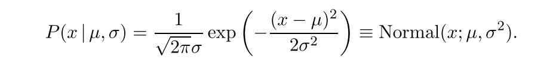
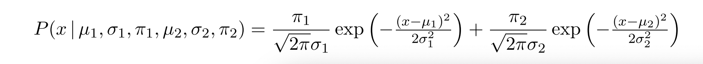
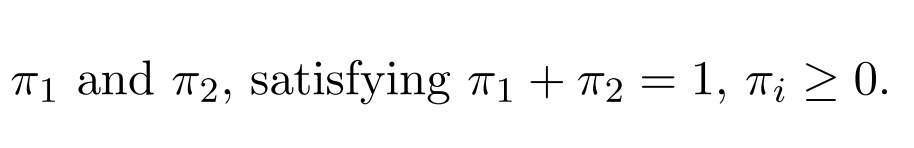

Exact Inference by Complete Enumeration
=======================================

Enumeration of a descretized hypothesis space for a Gaussian with paramters µ (horizontal axis) and σ (vertical)

Calculates the likelihood and posterior probabilities for the parameters of a Gaussian distribution. Creates a contour plot of the log likelihood as a function of µ and σ. 

and 

Enumeration of descretized hypothesis space for a mixture of two Gaussians 

with weight of the mixture components

Manual
======

Requires R

source("GaussianLikelihood.R")

data can be specified as 

data = \<any array\>

u = c(0,2) #range of mean values

sigma = c(.1,1) #range of σ 

mpi = c(.6) #weights for mixture components 

